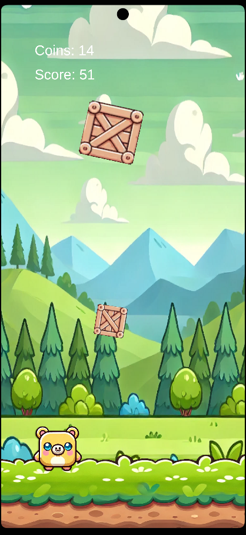

# FallingObstaclesGame-unity-2d

  

FallingObstaclesGame is a 2D mobile game for Android, developed in Unity. In this game, players control a cute character, dodging falling obstacles and collecting coins along the way. The game features a skin shop, score tracking, and customization options.

### Game Features

- **Character Control** - Players can move the character left and right to dodge falling obstacles.
- **Coin Collection** - Collect coins during gameplay to purchase new skins in the shop.
- **Skin Shop** - Customize your character with different skins available in the shop.
- **End Screen and Replay** - View your score at the end of each game and start again if desired.
- **High Score Tracking** - The game keeps track of the player’s highest score.

### Project Structure

- `Assets/` - Contains all game assets, including scripts, images, and audio files.
- `Packages/` - External libraries and packages used in the project.
- `ProjectSettings/` - General Unity project settings.

### Installation

- Download the code from the repository.
- Open the project in Unity.
- Use the **Build** option to compile the game for Android (APK).

### How to Play

- Launch the game and press **Start Game**.
- Move the character to dodge obstacles and collect coins.
- Use collected coins in the shop to unlock new skins.
- After each game, check your score and decide to play again or visit the shop.

### Technologies Used

- **Unity** - Game engine for developing the project.
- **C#** - Programming language for scripts and game logic.

### Assets Creation

All backgrounds and character designs were created using AI tools and further refined with Photoshop.

### Author

**Shay Marks** :

  

### Screenshots

#### Start Screen

|  |
| :----------------------------------------------------------: |
|                        _Start Screen_                        |

#### Gameplay

|  |  |
| :--------------------------------------------------------------: | :--------------------------------------------------------------: |
|                        _Gameplay Scene 1_                        |                        _Gameplay Scene 2_                        |

#### Game Over Screen

|  |  |
| :---------------------------------------------------------------: | :---------------------------------------------------------------: |
|                        _Game Over Scene 1_                        |                        _Game Over Scene 2_                        |

#### Skin Shop

|  |  |
| :----------------------------------------------------------------: | :----------------------------------------------------------------: |
|                        _Skin Shop Screen 1_                        |                        _Skin Shop Screen 2_                        |

### License

This project is licensed under the MIT License - see the [LICENSE](LICENSE) file for details.
